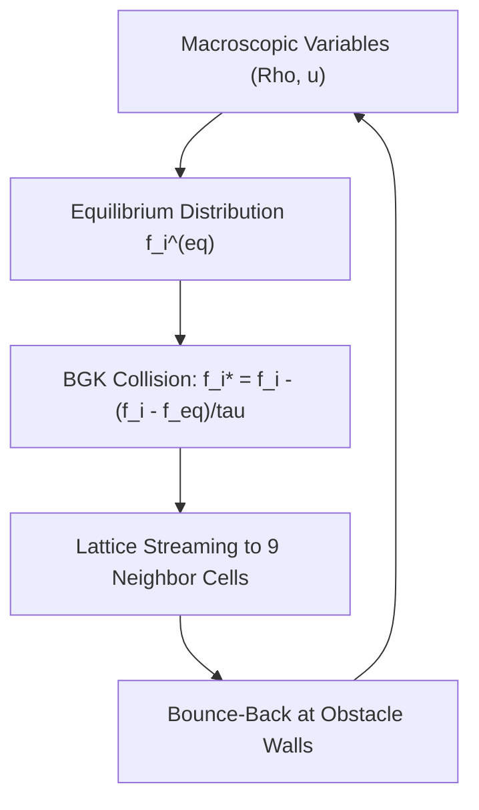

# genpark-lattice-boltzmann-d2q9-fluid-flow-skill

Agent Skill implementing the **D2Q9 Lattice Boltzmann Method (LBM)** with BGK relaxation collision operator and bounce-back obstacle boundary conditions.

## Architectural Overview

